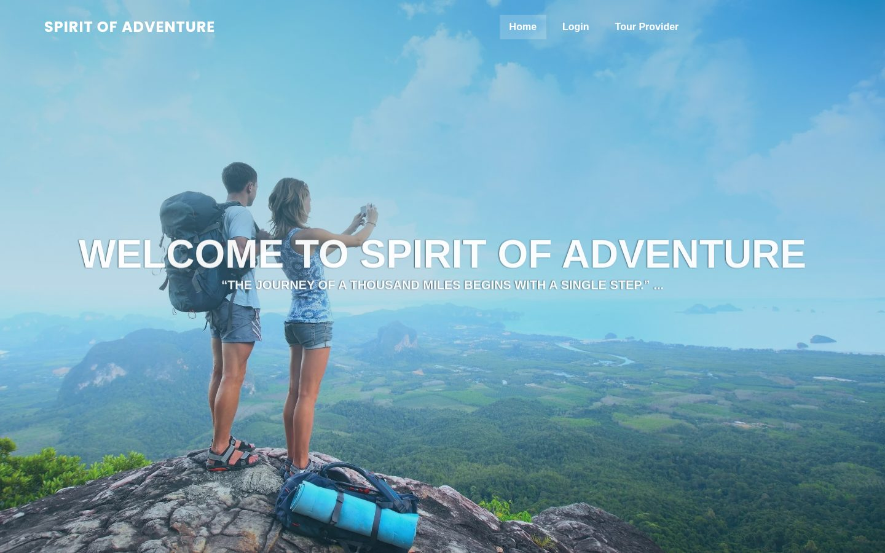
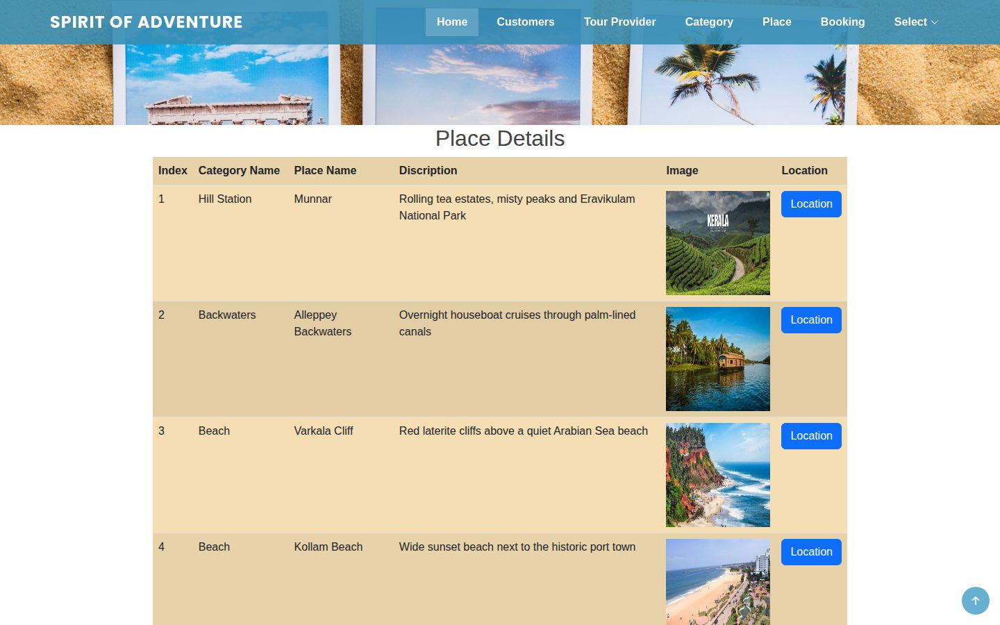
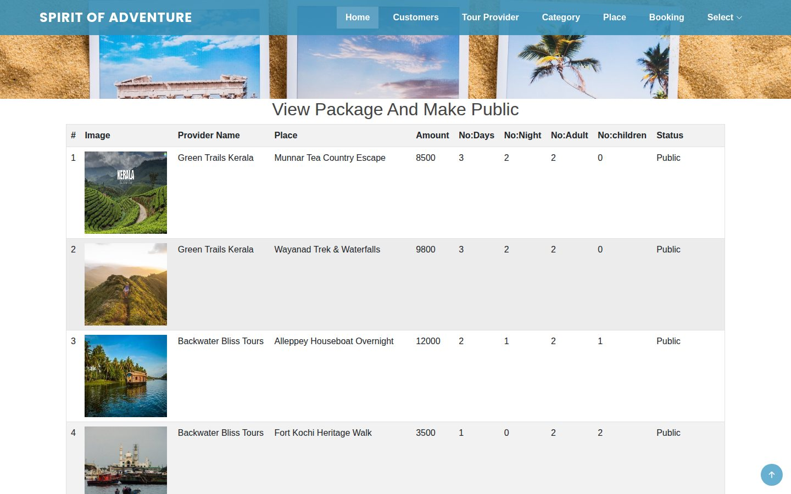
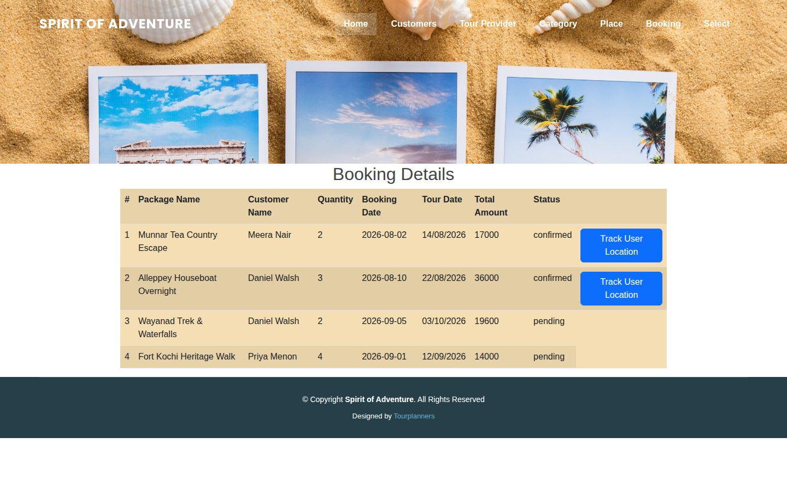
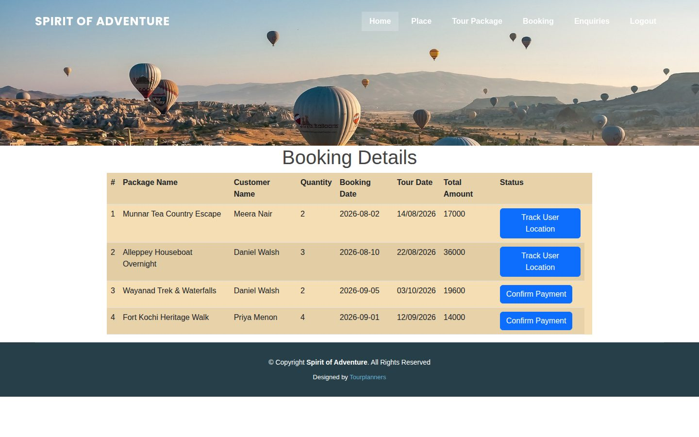
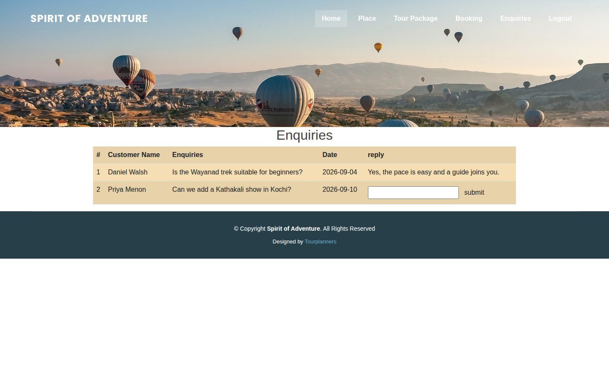
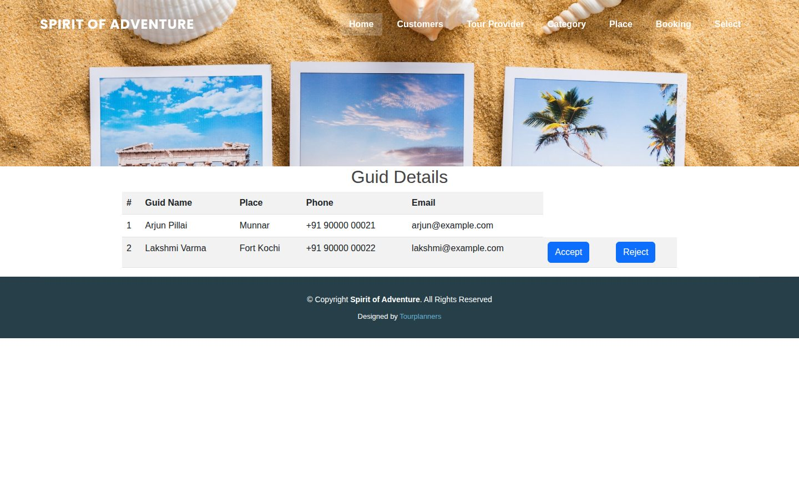
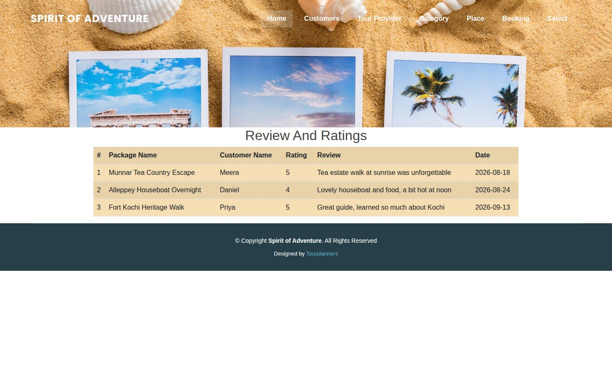
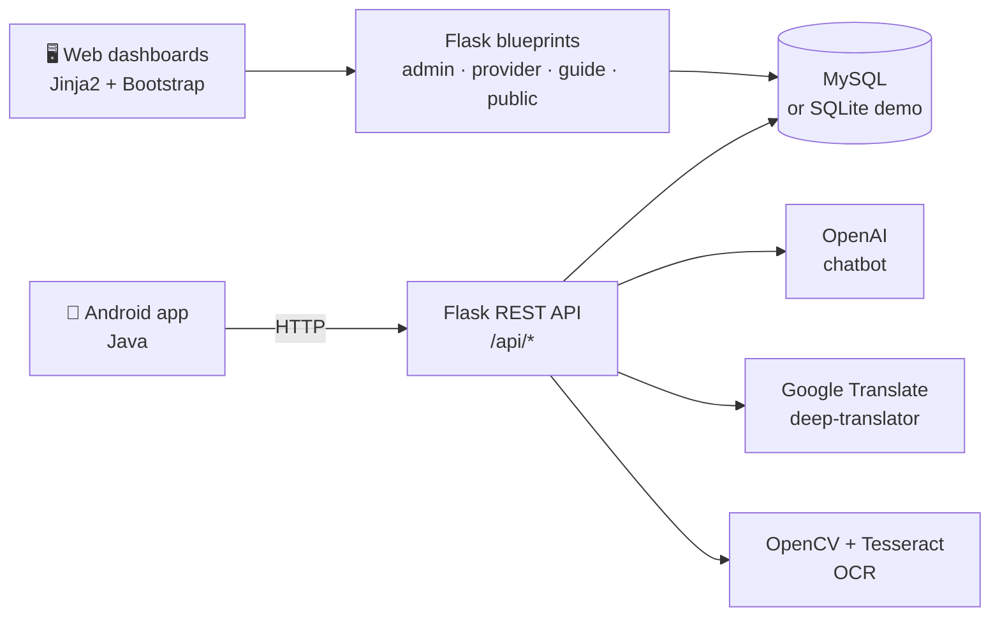

<div align="center">

# 🧭 AI Tour Planner

**A full-stack tourism platform that connects travellers, tour providers and local guides, with AI features for multilingual travel.**

Flask + MySQL backend with role-based web dashboards · native Android app for travellers · OpenAI chatbot · translation · photo-to-text OCR

### [🧭 Live demo: ai-tour-planner-7uzv.vercel.app](https://ai-tour-planner-7uzv.vercel.app/)

Demo logins: admin `admin` / `admin` · tour provider `greentrails` / `demo123` · guide `arjun` / `demo123` (fictional data, resets on restart)

[](https://vercel.com/new/clone?repository-url=https%3A%2F%2Fgithub.com%2Falokekissac%2FAI-Tour-Planner&project-name=ai-tour-planner)


</div>



---

## 📑 Contents

[Overview](#-overview) · [Screenshots](#-screenshots) · [Features](#-features) · [Architecture](#%EF%B8%8F-architecture) · [Demo accounts](#-demo-accounts) · [Run locally](#-run-locally) · [Deploy to Vercel](#%EF%B8%8F-deploy-to-vercel) · [API](#-rest-api) · [Project structure](#%EF%B8%8F-project-structure) · [Limitations](#-known-limitations) · [Author](#-author)

---

## 🔭 Overview

Travellers and local tour operators usually find each other through scattered channels, and language barriers make it harder still. AI Tour Planner puts the whole journey on **one platform**:

- **Providers** publish places and tour packages, and admins review and publish them.
- **Travellers** discover, book, pay for and review tours from an Android app.
- **Local guides** register and pin useful spots on the map.
- **AI features** help travellers abroad: a chatbot, translation into any language, and OCR that reads signs and menus from a photo.

Built during my **Full-Stack Developer internship at Rizz Technologies**.

---

## 📸 Screenshots

| | |
|---|---|
|  |  |
| **Landing page** | **Admin: places by category** |
|  |  |
| **Admin: review and publish provider packages** | **Admin: bookings** |
|  |  |
| **Provider: confirm payments, track travellers** | **Provider: answer traveller enquiries** |
|  |  |
| **Admin: approve local guides** | **Admin: ratings and reviews** |

<sub>Screenshots use the fictional Kerala demo data in <code>database/demo_data.sql</code>.</sub>

---

## ✨ Features

### Four roles, one platform

| Role | Where | What they can do |
|---|---|---|
| 🛡️ **Admin** | Web | Approve or reject providers and guides, manage place categories, view users, bookings, ratings and complaints, and **publish packages** |
| 🏢 **Tour provider** | Web | Register, add places (with photo and map location) and tour packages, confirm bookings and payments, answer enquiries |
| 🧑‍🏫 **Local guide** | Web | Register for a place and **pin spots on the map** (viewpoints, tea factories and so on) for travellers |
| 🎒 **Traveller** | Android | Search places, save favourites, book tours, pay, rate and review, send enquiries and complaints, chat with guides, see guides' pinned spots |

### AI & ML

| Feature | How |
|---|---|
| 🤖 **AI travel chatbot** | OpenAI completion model with a travel persona; each user's conversation is stored |
| 🌍 **Translate to any language** | `deep-translator` (Google Translate) |
| 📷 **Photo → text** | OpenCV preprocessing + Tesseract OCR to read signs and menus, ready to translate |
| 👁️ **Object detection** | YOLOv3 (COCO) script for images and video (`tour_planner_web/yolo/`) |
| 📝 **Text similarity** | NLTK stemming and stop-word removal with cosine similarity |

---

## 🏗️ Architecture



- **One Flask app** with five blueprints: `public` (landing, login and registration), `admin`, `provider`, `guid` (guide) and `api` (the Android app).
- **Two database modes:** MySQL for local and production use, or a bundled **SQLite demo database**, which is used automatically on Vercel.
- **The Android app** talks only to `/api/*`; you set the server address on its IP settings screen.

---

## 🔑 Demo accounts

| Role | Username | Password |
|---|---|---|
| Admin | `admin` | `admin` |
| Tour provider | `greentrails` | `demo123` |
| Local guide | `arjun` | `demo123` |
| Traveller (Android) | `meera` | `demo123` |

The demo data has 6 Kerala destinations (Munnar, Alleppey, Varkala, Kollam, Fort Kochi, Wayanad), 3 providers, 6 packages, bookings, reviews and guides. All people and companies in it are fictional.

---

## 🚀 Run locally

**Quick start (no MySQL needed):**

```bash
git clone https://github.com/alokekissac/AI-Tour-Planner.git
cd AI-Tour-Planner
python -m venv .venv && source .venv/bin/activate
pip install -r requirements.txt
DB_ENGINE=sqlite python tour_planner_web/main.py     # http://localhost:5819
```

**With MySQL:**

```bash
mysql -u root -p < database/schema.sql
mysql -u root -p tour_planner < database/demo_data.sql     # optional demo data
python tour_planner_web/main.py
```

**Optional AI extras** (OCR, NLTK, YOLO):

```bash
pip install -r tour_planner_web/requirements-ai.txt
brew install tesseract                     # or: apt install tesseract-ocr
export OPENAI_API_KEY=sk-...               # chatbot
```

YOLO weights (240 MB) aren't committed; download [`yolov3.weights`](https://pjreddie.com/media/files/yolov3.weights) into `tour_planner_web/yolo/yolo-coco/`.

**Android app:** open `Tour_planner/` in Android Studio and press Run. The first screen asks for the server: it's pre-filled with the live demo backend (`https://ai-tour-planner-7uzv.vercel.app`), so you can sign in straight away as `meera` / `demo123`. To use a local server instead, enter your computer's `IP:5819`.

### Configuration

| Variable | Default | Purpose |
|---|---|---|
| `DB_ENGINE` | `mysql` (`sqlite` on Vercel) | Database mode |
| `DB_HOST` · `DB_PORT` | `localhost` · `3307` | MySQL connection |
| `DB_USER` · `DB_PASSWORD` · `DB_NAME` | `root` · *(empty)* · `tour_planner` | MySQL credentials |
| `SECRET_KEY` | dev value | Signs Flask sessions (set this in production) |
| `OPENAI_API_KEY` | — | Enables the chatbot |

---

## ☁️ Deploy to Vercel

Click **Deploy with Vercel** at the top, or:

1. Import the repo at [vercel.com/new](https://vercel.com/new). No settings to change: Vercel detects the Flask app in `app.py`.
2. Optionally add the `SECRET_KEY` and `OPENAI_API_KEY` environment variables.
3. Click **Deploy**.

**How it runs on Vercel:**
- `app.py` at the repo root exposes the Flask app from `tour_planner_web/`.
- Everything in `public/` (CSS, JS, demo photos) is served from Vercel's CDN.
- The app runs in **demo mode**: the bundled SQLite database is copied to `/tmp` at start-up, and uploads go to `/tmp` too. Visitors can click around freely, and it resets whenever the instance restarts.
- To use a real database, set `DB_ENGINE=mysql` and the `DB_*` variables for any hosted MySQL.
- `.vercelignore` leaves the Android project, docs and YOLO files out of the serverless bundle, and OCR is disabled in this lightweight build.

---

## 🔌 REST API

The Android app uses these endpoints under `/api` (selection):

| Endpoint | Purpose |
|---|---|
| `GET /api/login` | Sign in (returns role and IDs) |
| `GET /api/Customer_registration` | Register a traveller |
| `GET /api/Public_view_places` · `/api/publicsearch` | Browse and search published packages |
| `GET /api/customer_add_favorite` · `/api/Customer_view_favorite` | Favourites |
| `GET /api/Customer_booking_tour` · `/api/payment` | Book and pay |
| `GET /api/Review` · `/api/viewrating` | Ratings and reviews |
| `GET /api/Customer_send_enquiries` · `/api/Customer_send_complaint` | Enquiries and complaints |
| `GET /api/Customer_view_guid` · `/api/Customer_view_marked_location` | Guides and their pinned spots |
| `GET/POST /api/chat` · `/api/chatdetail` | Chat with guides |
| `POST /api/user_chat_ai_bot` | AI chatbot |
| `POST /api/trasilation` · `/api/filetrasilation` | Translate text |
| `POST /api/User_upload_images` | Photo → OCR text |

---

## 🗂️ Project structure

```
.
├── app.py                      # Vercel entrypoint (exposes the Flask app)
├── requirements.txt            # Web app dependencies
├── public/static/              # CSS, JS, images, demo photos (CDN on Vercel)
├── tour_planner_web/           # Flask application
│   ├── main.py                 # App factory + blueprints (run this locally)
│   ├── public.py · admin.py · provider.py · guid.py
│   ├── api.py                  # REST API for the Android app
│   ├── database.py             # MySQL / SQLite demo mode + uploads
│   ├── demo.sqlite             # Demo database used on Vercel
│   ├── opai.py                 # OpenAI chatbot
│   ├── translatetoanylang.py   # Translation helpers
│   ├── templates/              # Jinja2 pages
│   ├── yolo/                   # YOLOv3 object detection
│   └── requirements-ai.txt     # Optional OCR / NLTK / YOLO extras
├── Tour_planner/               # Android app (Java, Android Studio)
├── database/
│   ├── schema.sql              # MySQL schema
│   └── demo_data.sql           # Fictional demo data
└── docs/screenshots/
```

---

## ⚠️ Known limitations

This project began as an internship prototype. Before real production use, it would need:
- **Parameterised SQL queries.** Queries are currently built with string formatting, which leaves them open to SQL injection.
- **Hashed passwords** (e.g. `werkzeug.security`) instead of plain-text storage.
- **A JSON API with token auth** in place of GET requests that carry credentials in the query string.
- **An update of the OpenAI integration** to the current SDK and chat models.

---

## 👤 Author

**Aloke**, AI Engineer & Full-Stack Developer · Dublin, Ireland
[GitHub](https://github.com/alokekissac) · [LinkedIn](https://www.linkedin.com/in/alokekisssac/)
